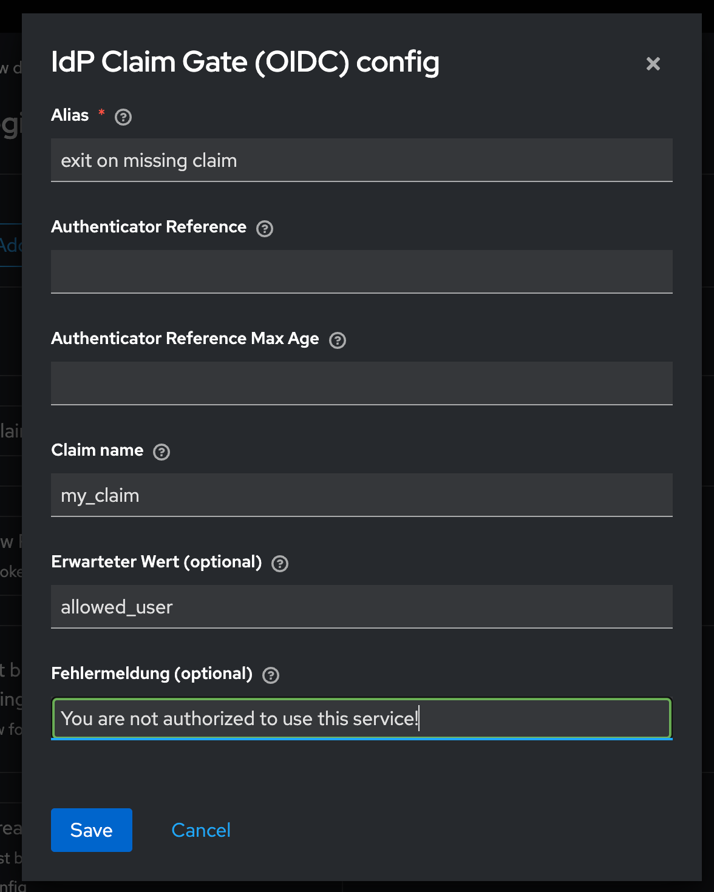

# Keycloak IdP Claim Gate (OIDC)

This project provides a **custom Keycloak authenticator** that blocks or allows
logins from an external Identity Provider (IdP, e.g. Entra/Azure AD) based on
the presence (and optional value) of a claim in the **OIDC ID token or UserInfo**.

---

## Features

- Verify that a specific claim exists in the ID token or UserInfo response.
- Optionally check the claim’s value (e.g. `department = IT`).
- If the check fails, the user is blocked with a custom error message and
  the account is **not created** in Keycloak.
- Can be plugged into:
  - **First Broker Login flow** (before the user is created)
  - **Post Login flow** (after login, for additional gating)

---

## Installation

1. Build the JAR:

   ```bash
   mvn clean package
   ```

2. Copy the built file into your Keycloak providers folder:

   ```bash
   cp target/keycloak-idp-claim-gate-*.jar /opt/keycloak/providers/
   ```

3. Restart Keycloak (or `kc.sh build` if you use the Quarkus distribution).

---

# Deployment Examples for keycloak-idp-claim-gate

This file shows how to include the custom authenticator JAR in both
**Helm (values.yaml)** and **docker-compose.yml** setups.

---

## Helm Chart (values.yaml)

If you use the Bitnami Keycloak Helm chart, you can mount extra providers like this:

```yaml
extraVolumes:
  - name: idp-claim-gate
    configMap:
      name: idp-claim-gate-jar

extraVolumeMounts:
  - name: idp-claim-gate
    mountPath: /opt/keycloak/providers/keycloak-idp-claim-gate.jar
    subPath: keycloak-idp-claim-gate.jar

extraEnvVars:
  - name: KC_LOG_LEVEL
    value: DEBUG
```

You would first create a ConfigMap with the JAR:

```bash
kubectl create configmap idp-claim-gate-jar   --from-file=keycloak-idp-claim-gate.jar=target/keycloak-idp-claim-gate-1.0.0.jar
```

---

## Docker Compose

To use with docker-compose, mount the JAR into `/opt/keycloak/providers`:

```yaml
version: '3.8'
services:
  keycloak:
    image: quay.io/keycloak/keycloak:26.0.5
    command: ["start-dev"]
    environment:
      - KC_DB=postgres
      - KC_DB_URL_HOST=postgres
      - KC_DB_USERNAME=keycloak
      - KC_DB_PASSWORD=keycloak
      - KC_LOG_LEVEL=DEBUG
    volumes:
      - ./target/keycloak-idp-claim-gate-1.0.0.jar:/opt/keycloak/providers/keycloak-idp-claim-gate.jar
    ports:
      - "8080:8080"
    depends_on:
      - postgres

  postgres:
    image: postgres:15
    environment:
      POSTGRES_USER: keycloak
      POSTGRES_PASSWORD: keycloak
      POSTGRES_DB: keycloak
    volumes:
      - postgres_data:/var/lib/postgresql/data

volumes:
  postgres_data:
```

---

## Notes

- After mounting the JAR, Keycloak must be restarted (or rebuilt with `kc.sh build`).
- Logs will show whether the authenticator was loaded successfully:
  ```
  INFO  [org.keycloak.services] (main) KC-SERVICES0050: Initializing authenticator factory: idp-claim-gate
  ```
---

## Configuration

### 1. Configure the First Broker Login Flow

Open **Realm Settings → Authentication → Flows → first broker login**  
and add a new step: **IdP Claim Gate (OIDC)**.

Example:


---

### 2. Configure the Authenticator

Click the gear ⚙️ on the **IdP Claim Gate (OIDC)** step and set:

- **Claim name**: e.g. `my_claim`
- **Expected value (optional)**: e.g. `allowed_user`
- **Error message (optional)**: e.g. `You are not authorized to use this service!`

Example:



---

### 3. Bind the Flow to Your Identity Provider

Go to **Identity Providers → (your OIDC IdP)** and set:

- **First login flow override** → `first broker login`
- (Optionally) configure **Post login flow override** if you want to run the
  gate after successful login as well.

Example:


---

## Usage

- When a user logs in via the configured IdP:
  - If the claim exists (and matches the expected value if set) → login proceeds.
  - If the claim is missing or does not match → login is blocked with the
    configured error message.

---

## Troubleshooting

- Enable DEBUG logging for your package to inspect claims:
  ```bash
  KC_LOG_LEVEL=DEBUG
  ```
- Look for lines like:
  ```
  ContextData: key=user.attributes.my_claim, value=[allowed_user]
  ```
- Ensure your IdP is actually returning the claim (configure scopes like `profile` or `email` if necessary).

---


